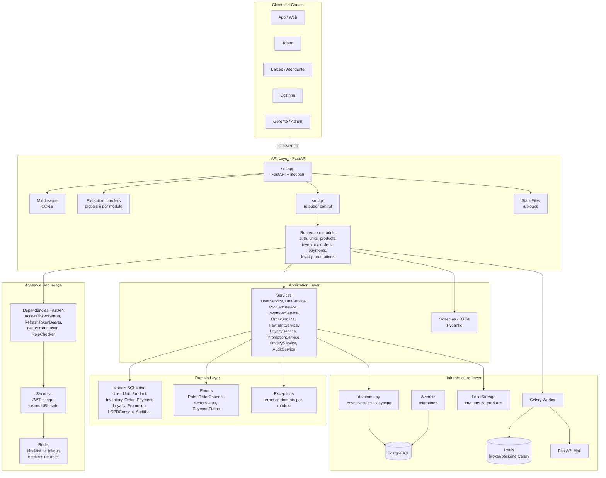

# Diagrama de Arquitetura por Camadas

```mermaid
flowchart TB
    subgraph Clients["Clientes e Canais"]
        APP["App / Web"]
        TOTEM["Totem"]
        COUNTER["Balcão / Atendente"]
        KITCHEN["Cozinha"]
        ADMIN["Gerente / Admin"]
    end

    subgraph API["API Layer - FastAPI"]
        APP_ENTRY["src.app<br/>FastAPI + lifespan"]
        API_ROUTER["src.api<br/>roteador central"]
        ROUTERS["Routers por módulo<br/>auth, units, products,<br/>inventory, orders, payments,<br/>loyalty, promotions"]
        MIDDLEWARE["Middleware<br/>CORS"]
        EX_HANDLERS["Exception handlers<br/>globais e por módulo"]
        STATIC["StaticFiles<br/>/uploads"]
    end

    subgraph Access["Acesso e Segurança"]
        DEPENDENCIES["Dependências FastAPI<br/>AccessTokenBearer, RefreshTokenBearer,<br/>get_current_user, RoleChecker"]
        SECURITY["Security<br/>JWT, bcrypt,<br/>tokens URL-safe"]
        REDIS_BLOCKLIST["Redis<br/>blocklist de tokens<br/>e tokens de reset"]
    end

    subgraph Application["Application Layer"]
        SERVICES["Services<br/>UserService, UnitService,<br/>ProductService, InventoryService,<br/>OrderService, PaymentService,<br/>LoyaltyService, PromotionService,<br/>PrivacyService, AuditService"]
        SCHEMAS["Schemas / DTOs<br/>Pydantic"]
    end

    subgraph Domain["Domain Layer"]
        MODELS["Models SQLModel<br/>User, Unit, Product,<br/>Inventory, Order, Payment,<br/>Loyalty, Promotion,<br/>LGPDConsent, AuditLog"]
        ENUMS["Enums<br/>Role, OrderChannel,<br/>OrderStatus, PaymentStatus"]
        EXCEPTIONS["Exceptions<br/>erros de domínio por módulo"]
    end

    subgraph Infrastructure["Infrastructure Layer"]
        DB_SESSION["database.py<br/>AsyncSession + asyncpg"]
        POSTGRES[("PostgreSQL")]
        ALEMBIC["Alembic<br/>migrations"]
        CELERY["Celery Worker"]
        REDIS_BROKER[("Redis<br/>broker/backend Celery")]
        MAIL["FastAPI Mail"]
        STORAGE["LocalStorage<br/>imagens de produtos"]
    end

    Clients -->|"HTTP/REST"| APP_ENTRY

    APP_ENTRY --> MIDDLEWARE
    APP_ENTRY --> EX_HANDLERS
    APP_ENTRY --> API_ROUTER
    APP_ENTRY --> STATIC
    API_ROUTER --> ROUTERS

    ROUTERS --> DEPENDENCIES
    DEPENDENCIES --> SECURITY
    SECURITY --> REDIS_BLOCKLIST

    ROUTERS --> SERVICES
    ROUTERS --> SCHEMAS
    SERVICES --> MODELS
    SERVICES --> ENUMS
    SERVICES --> EXCEPTIONS
    SERVICES --> DB_SESSION

    DB_SESSION --> POSTGRES
    ALEMBIC --> POSTGRES

    SERVICES --> STORAGE
    ROUTERS --> CELERY
    CELERY --> REDIS_BROKER
    CELERY --> MAIL
```
