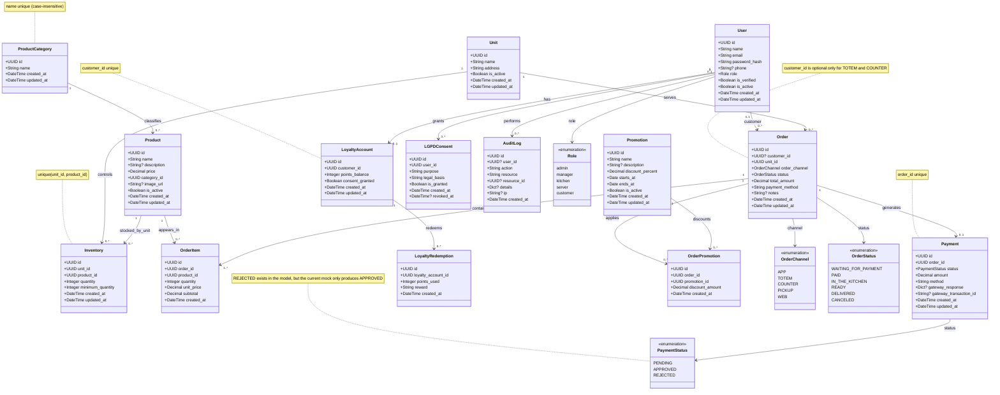

# Diagrama de Classes

```mermaid
classDiagram
    class User {
        +UUID id
        +String name
        +String email
        +String password_hash
        +String? phone
        +Role role
        +Boolean is_verified
        +Boolean is_active
        +DateTime created_at
        +DateTime updated_at
    }

    class Unit {
        +UUID id
        +String name
        +String address
        +Boolean is_active
        +DateTime created_at
        +DateTime updated_at
    }

    class Product {
        +UUID id
        +String name
        +String? description
        +Decimal price
        +UUID category_id
        +String? image_url
        +Boolean is_active
        +DateTime created_at
        +DateTime updated_at
    }

    class ProductCategory {
        +UUID id
        +String name
        +DateTime created_at
        +DateTime updated_at
    }

    class Inventory {
        +UUID id
        +UUID unit_id
        +UUID product_id
        +Integer quantity
        +Integer minimum_quantity
        +DateTime created_at
        +DateTime updated_at
    }

    class Order {
        +UUID id
        +UUID? customer_id
        +UUID unit_id
        +OrderChannel order_channel
        +OrderStatus status
        +Decimal total_amount
        +String payment_method
        +String? notes
        +DateTime created_at
        +DateTime updated_at
    }

    class OrderItem {
        +UUID id
        +UUID order_id
        +UUID product_id
        +Integer quantity
        +Decimal unit_price
        +Decimal subtotal
        +DateTime created_at
    }

    class Payment {
        +UUID id
        +UUID order_id
        +PaymentStatus status
        +Decimal amount
        +String method
        +Dict? gateway_response
        +String? gateway_transaction_id
        +DateTime created_at
        +DateTime updated_at
    }

    class LoyaltyAccount {
        +UUID id
        +UUID customer_id
        +Integer points_balance
        +Boolean consent_granted
        +DateTime created_at
        +DateTime updated_at
    }

    class LoyaltyRedemption {
        +UUID id
        +UUID loyalty_account_id
        +Integer points_used
        +String reward
        +DateTime created_at
    }

    class Promotion {
        +UUID id
        +String name
        +String? description
        +Decimal discount_percent
        +Date starts_at
        +Date ends_at
        +Boolean is_active
        +DateTime created_at
        +DateTime updated_at
    }

    class OrderPromotion {
        +UUID id
        +UUID order_id
        +UUID promotion_id
        +Decimal discount_amount
        +DateTime created_at
    }

    class LGPDConsent {
        +UUID id
        +UUID user_id
        +String purpose
        +String legal_basis
        +Boolean is_granted
        +DateTime created_at
        +DateTime? revoked_at
    }

    class AuditLog {
        +UUID id
        +UUID? user_id
        +String action
        +String resource
        +UUID? resource_id
        +Dict? details
        +String? ip
        +DateTime created_at
    }

    %% Enums
    class Role {
        <<enumeration>>
        admin
        manager
        kitchen
        server
        customer
    }

    class OrderChannel {
        <<enumeration>>
        APP
        TOTEM
        COUNTER
        PICKUP
        WEB
    }

    class OrderStatus {
        <<enumeration>>
        WAITING_FOR_PAYMENT
        PAID
        IN_THE_KITCHEN
        READY
        DELIVERED
        CANCELED
    }

    class PaymentStatus {
        <<enumeration>>
        PENDING
        APPROVED
        REJECTED
    }

    %% Relacionamentos
    User "0..1" --> "0..*" Order : customer
    User "1" --> "0..1" LoyaltyAccount : has
    User "1" --> "0..*" LGPDConsent : grants
    User "0..1" --> "0..*" AuditLog : performs
    Unit "1" --> "0..*" Inventory : controls
    Unit "1" --> "0..*" Order : serves
    ProductCategory "1" --> "0..*" Product : classifies
    Product "1" --> "0..*" OrderItem : appears_in
    Product "1" --> "0..*" Inventory : stocked_by_unit
    Order "1" --> "1..*" OrderItem : contains
    Order "1" --> "0..1" Payment : generates
    Order "1" --> "0..*" OrderPromotion : applies
    Promotion "1" --> "0..*" OrderPromotion : discounts
    LoyaltyAccount "1" --> "0..*" LoyaltyRedemption : redeems

    User --> Role : role
    Order --> OrderChannel : channel
    Order --> OrderStatus : status
    Payment --> PaymentStatus : status

    note for ProductCategory "name unique (case-insensitive)"
    note for Inventory "unique(unit_id, product_id)"
    note for Payment "order_id unique"
    note for LoyaltyAccount "customer_id unique"
    note for Order "customer_id is optional only for TOTEM and COUNTER"
    note for PaymentStatus "REJECTED exists in the model, but the current mock only produces APPROVED"
```
