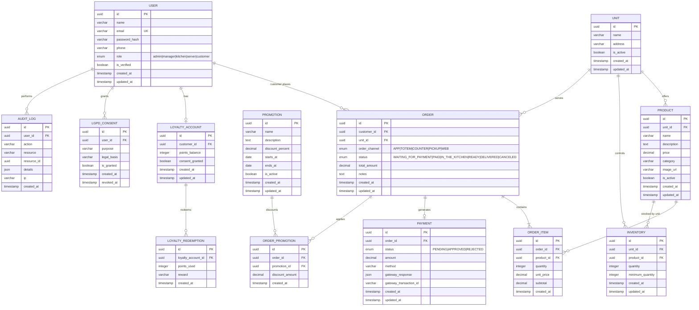

# DER - Diagrama Entidade-Relacionamento

```mermaid
erDiagram
    USER {
        uuid id PK
        varchar name
        varchar email UK
        varchar password_hash
        varchar phone
        enum role "admin|manager|kitchen|server|customer"
        boolean is_verified
        timestamp created_at
        timestamp updated_at
    }

    UNIT {
        uuid id PK
        varchar name
        varchar address
        boolean is_active
        timestamp created_at
        timestamp updated_at
    }

    PRODUCT {
        uuid id PK
        uuid unit_id FK
        varchar name
        text description
        decimal price
        varchar category
        varchar image_url
        boolean is_active
        timestamp created_at
        timestamp updated_at
    }

    INVENTORY {
        uuid id PK
        uuid unit_id FK
        uuid product_id FK
        integer quantity
        integer minimum_quantity
        timestamp created_at
        timestamp updated_at
    }

    ORDER {
        uuid id PK
        uuid customer_id FK
        uuid unit_id FK
        enum order_channel "APP|TOTEM|COUNTER|PICKUP|WEB"
        enum status "WAITING_FOR_PAYMENT|PAID|IN_THE_KITCHEN|READY|DELIVERED|CANCELED"
        decimal total_amount
        text notes
        timestamp created_at
        timestamp updated_at
    }

    ORDER_ITEM {
        uuid id PK
        uuid order_id FK
        uuid product_id FK
        integer quantity
        decimal unit_price
        decimal subtotal
        timestamp created_at
    }

    PAYMENT {
        uuid id PK
        uuid order_id FK
        enum status "PENDING|APPROVED|REJECTED"
        decimal amount
        varchar method
        json gateway_response
        varchar gateway_transaction_id
        timestamp created_at
        timestamp updated_at
    }

    LOYALTY_ACCOUNT {
        uuid id PK
        uuid customer_id FK
        integer points_balance
        boolean consent_granted
        timestamp created_at
        timestamp updated_at
    }

    LOYALTY_REDEMPTION {
        uuid id PK
        uuid loyalty_account_id FK
        integer points_used
        varchar reward
        timestamp created_at
    }

    PROMOTION {
        uuid id PK
        varchar name
        text description
        decimal discount_percent
        date starts_at
        date ends_at
        boolean is_active
        timestamp created_at
        timestamp updated_at
    }

    ORDER_PROMOTION {
        uuid id PK
        uuid order_id FK
        uuid promotion_id FK
        decimal discount_amount
        timestamp created_at
    }

    LGPD_CONSENT {
        uuid id PK
        uuid user_id FK
        varchar purpose
        varchar legal_basis
        boolean is_granted
        timestamp created_at
        timestamp revoked_at
    }

    AUDIT_LOG {
        uuid id PK
        uuid user_id FK
        varchar action
        varchar resource
        uuid resource_id
        json details
        varchar ip
        timestamp created_at
    }

    %% Relacionamentos
    USER ||--o{ ORDER : "customer places"
    USER ||--o| LOYALTY_ACCOUNT : "has"
    USER ||--o{ LGPD_CONSENT : "grants"
    USER ||--o{ AUDIT_LOG : "performs"
    UNIT ||--o{ PRODUCT : "offers"
    UNIT ||--o{ INVENTORY : "controls"
    UNIT ||--o{ ORDER : "serves"
    PRODUCT ||--o{ ORDER_ITEM : "appears in"
    PRODUCT ||--o{ INVENTORY : "stocked by unit"
    ORDER ||--|{ ORDER_ITEM : "contains"
    ORDER ||--o| PAYMENT : "generates"
    ORDER ||--o{ ORDER_PROMOTION : "applies"
    PROMOTION ||--o{ ORDER_PROMOTION : "discounts"
    LOYALTY_ACCOUNT ||--o{ LOYALTY_REDEMPTION : "redeems"
```
