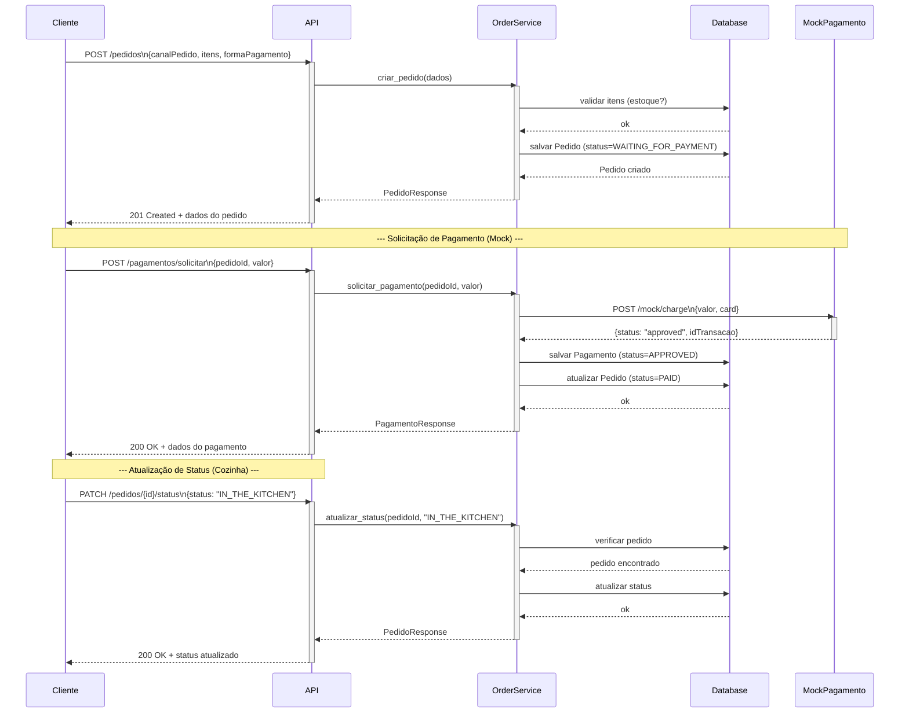

# Diagrama de Sequência - Fluxo Crítico

```mermaid
sequenceDiagram
    participant C as Cliente
    participant API as API
    participant S as OrderService
    participant DB as Database
    participant MP as MockPagamento

    C->>API: POST /pedidos\n{canalPedido, itens, formaPagamento}
    activate API

    API->>S: criar_pedido(dados)
    activate S

    S->>DB: validar itens (estoque?)
    DB-->>S: ok

    S->>DB: salvar Pedido (status=WAITING_FOR_PAYMENT)
    DB-->>S: Pedido criado

    S-->>API: PedidoResponse
    deactivate S
    API-->>C: 201 Created + dados do pedido
    deactivate API

    Note over C,MP: --- Solicitação de Pagamento (Mock) ---

    C->>API: POST /pagamentos/solicitar\n{pedidoId, valor}
    activate API

    API->>S: solicitar_pagamento(pedidoId, valor)
    activate S

    S->>MP: POST /mock/charge\n{valor, card}
    activate MP

    MP-->>S: {status: "approved", idTransacao}
    deactivate MP

    S->>DB: salvar Pagamento (status=APPROVED)
    S->>DB: atualizar Pedido (status=PAID)
    DB-->>S: ok

    S-->>API: PagamentoResponse
    deactivate S
    API-->>C: 200 OK + dados do pagamento
    deactivate API

    Note over C,API: --- Atualização de Status (Cozinha) ---

    C->>API: PATCH /pedidos/{id}/status\n{status: "IN_THE_KITCHEN"}
    activate API

    API->>S: atualizar_status(pedidoId, "IN_THE_KITCHEN")
    activate S

    S->>DB: verificar pedido
    DB-->>S: pedido encontrado

    S->>DB: atualizar status
    DB-->>S: ok

    S-->>API: PedidoResponse
    deactivate S
    API-->>C: 200 OK + status atualizado
    deactivate API
```

## Legenda

| Diagrama | Status | Descrição |
|----------|--------|-----------|
| Sequência | Projetado | Fluxo crítico: Pedido → Pagamento Mock → Status |
